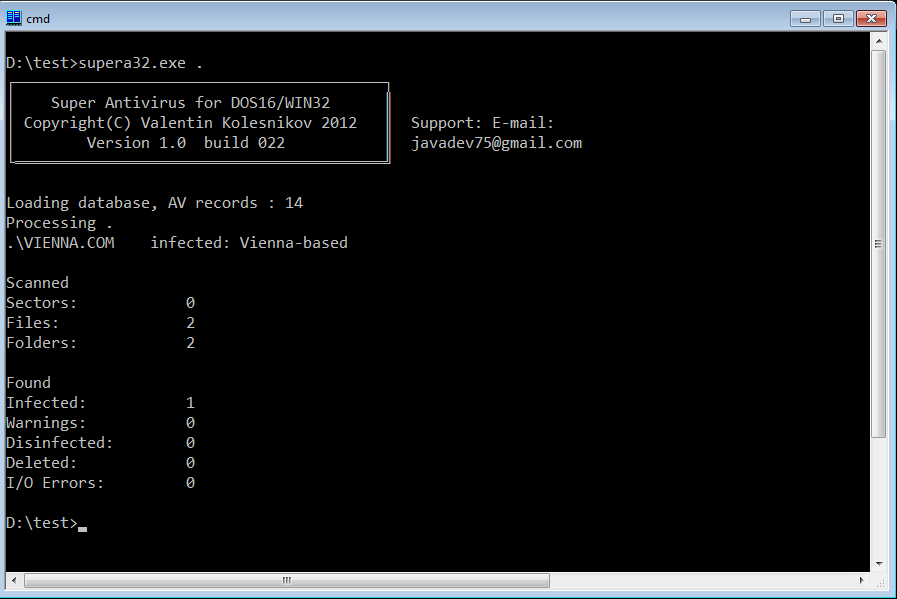

*************************************************************************
                    Super Antivirus для DOS и WIN32
                         Версия 1.0, билд 023
                   Июнь 2015 года. Valentyn Kolesnikov
*************************************************************************

Комплект SuperAV для DOS и WIN32
--------------------------------
SuperAV включает в себя следующие файлы:

 - README.TXT    - файл c описанием
 - SUPERA16.EXE  - SuperAV сканер для DOS (командная строка)
 - SUPERA32.EXE  - SuperAV сканер для WIN32 (командная строка)
 - FINDF.C       - модуль: поиск файлов на диске
 - SUPERBAS.C    - модуль: описание масок вирусов
 - SUPERLNK.C    - модуль: описание программ обнаружения и лечения
 - SUPERTST.C    - модуль: описание программ обнаружения и лечения
 - SUPERAV.C     - модуль: проверка файлов, памяти, секторов
 - SUPERAV.H     - модуль: описание переменных и функций

Запуск SuperAV из командной строки и коды возврата (errorlevels)
----------------------------------------------------------------

Формат:  SUPERA16 [опции] [путь[\имя][...]]
     Путь - любой путь DOS
     Имя - имя файла 
Опции:

 - /*  проверять все файлы
 - /-  удалять вирусы
 - /E  удалять файлы с вирусом
 - /L  показать список вирусов
 - /O  выводить OK после имени
 - /R  не проверять файлы в подкаталогах
 - /B  не проверять загрузочные сектора
 - /M  не проверять оперативую память DOS
 - /V  избыточное сканирование при проверке файлов
 - /W[=filename] создать файл-отчет
 - /Z  запретить останов программы во время сканирования

Результаты сканирования доступны через коды возврата (DOS Errorlevel) при
использовании пакетных файлов:

 -  0 - вирусов не обнаружено;
 -  1 - сканирование не закончено;
 -  3 - найдены объекты, подозрительные на вирус;
 -  4 - обнаружен вирус;
 -  5 - все обнауженные виусы удалены;

О всех найденных ошибках пишите тут.

